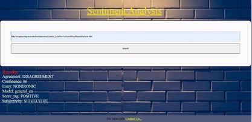

# Evaluate a News article with Natural Language Processsing

This project is a web tool that allows users to run Natural Language Processing (NLP) on articles or blogs found on other websites. Using MeaningCloud API, This tool will give  back pertinent information about the article, like:  modal , subjectivity, score_tag,agreement ,  confidence , irony 
____

## Run project
Below shows how to run in development and production mode.
___
## Table of contents 

  - [Run in development mode](#run-in-development-mode)
  - [Run in production mode](#run-in-production-mode)
  - [Run Test](#testing-run)
  - [Offline Functionality](#offline-functionality)
  - [Final output](#final-output)

## Run in development mode
To start the webpack dev server at port 8080
```
$ npm run build-dev
```
___
## Run in production mode

```
$npm run build-prod
```
```
$ npm run start
```
___
## Testing Run
```
npm run test 
```
___
## Offline Functionality
The project have service workers set up in webpack to provide the offline functionality of our app.
___
## Final Output



